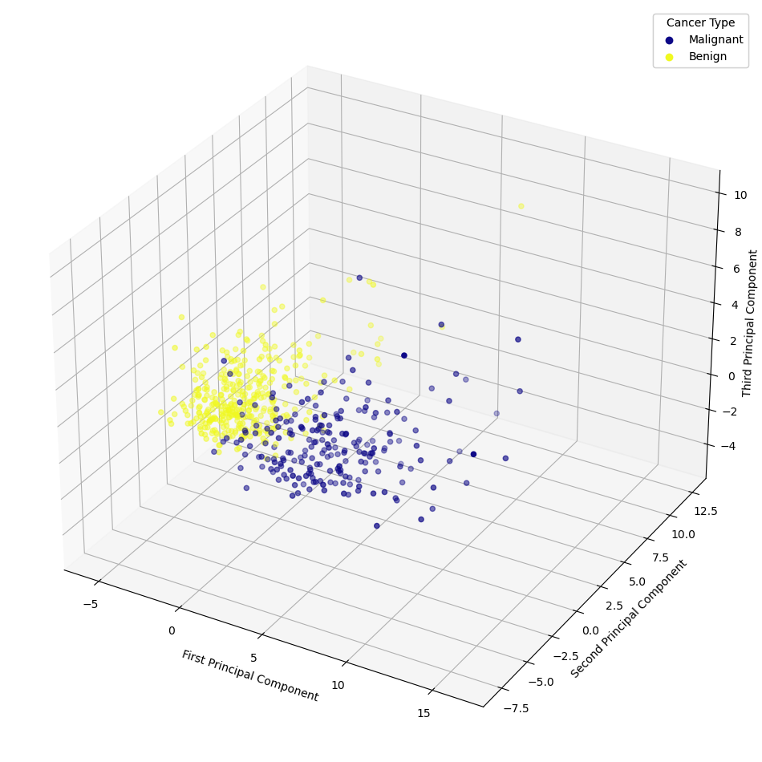
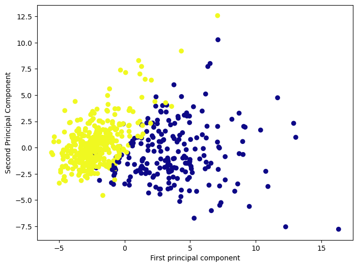
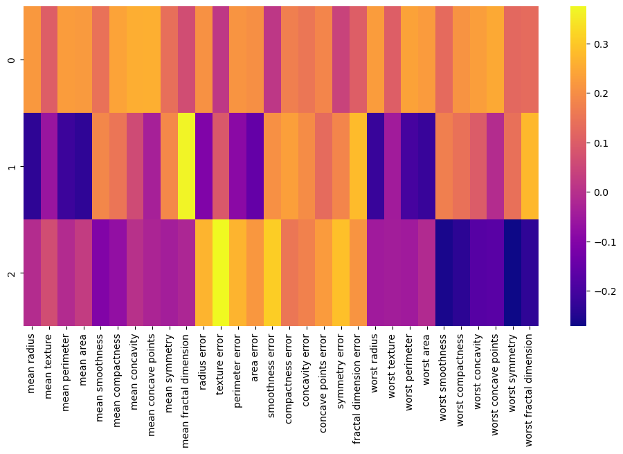
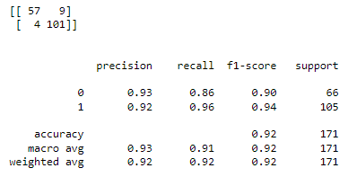
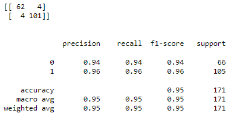

# Breast Cancer Prediction with Principal Component Analysis and Support Vector Machines 

## Project Overview
There are two objectives of this project:

**1) To showcase my ability and understanding of Principal component Analysis and Support Vector Machines. Accruacy is not the main priority because I created a more accurate algorithm using Deep Learning (Keras), which is a seperate project.**

2) To create an algorithm to predict whether or not a breast tumor is benign (non-cancerous) or malignant (cancerous) based off the characteristics of the cell nuclei that are present.

This is a high dimensional data set with multiple variables, so I leveraged Principal Component Analysis and Support Vector Machines to create my algorithm. After parameteer optimization, my algorithm is able to predict whether the tumors are benign or malignant with a 95% overall acccuracy and a 94% F1-score for benign, and 96% F-1 score for malignant. The F1-score is a measure of a model's accuracy that considers both the precision (the number of true positive results divided by the number of all positive results, including those not identified correctly) and the recall (the number of true positive results divided by the number of all samples that should have been identified as positive).

The data is from the Breast Cancer Wisconsin (Diagnostic) dataset provided by the University of Wisconsin (1995). 

The characteristics of the cell nuclei within the data set include:
- radius (mean of distances from center to points on the perimeter)
- texture (standard deviation of gray-scale values)
- perimeter
- area
- smoothness (local variation in radius lengths)
- compactness (perimeter^2 / area - 1.0)
- concavity (severity of concave portions of the contour)
- concave points (number of concave portions of the contour)
- symmetry
- fractal dimension ("coastline approximation" - 1)

## Libraries Used
numpy (numerical operations), pandas (data manipulation), matplotlib (visualization), seaborn (visualization), sklearn (machine learning tasks)

## Principal Component Analysis (PCA)

Aa mentioned before, this is a high dimensional Dataset with 30 input variables/attributes. Principal Component Analysis (PCA) helps by finding new dimensions that better capture the variance in the data. These new dimensions are called principal components. Principal components are linear combinations of the original features, arranged in such a way that the first few retain most of the variation present in all of the original dimensions. So I used PCA in order to reduce this dimensionality from 30 to 3 and focus on the highest variance components. On top of dimensionality reduction, PCA is powerful for this task because it identifies the most informative features of the dataset and reduces the risk of overfitting the algorithm.

I scaled the data before applying PCA to maximize the variance of the features, give equal weight to all features, and more. I then fit it into and transformed the dataset. I then applied PCA to the scaled dataset with 3 principal components. I originally reduced it to 2 components and tried other amounts, but found that 3 principal components ultimately led to the most accurate algorithm. 

Below is a visualization for all 3 principal components:

Below is a visualization for the first 2 principal components:

### Interpreting the Components
Below is a heatmap that visualizes the relationship between the three principal components and the features with the rows being the principal components and the columns being the features. The colors represent how correlated the specific feature is to the principal component, with a yellow color being the most positively correlated and a purple color being the most negatively correlated.

## Support Vector Machine (SVM) Algorithm
I split the testing and training data and applied a Support Vector Classifier to my model. Support Vector Machines are good for this situation because they are effective in high dimensional datasets, binary classifications, feature transformation, and clinical predictions. I then used this model to make precitions on the testing data.

### Initial Predictions and Evaluations
Belows is the confusion matrix and classification report for the predictions. The initial algorithm did decent, with a 92% overall accuracy and a 90% F1-score for benign and 94% F-1 score for malignant. 

However, due to the severity of falsely diagnosing a cancer as benign or malignant, I wanted to improve this algorithm...

## Fine-Tuning the Parameters for the Algorithm
I used a GridSearch in order to test different parameters. 
When fine-tuning a Support Vector Machine (SVM) model, two critical parameters often require optimization: the C value and the gamma value. These parameters control the model's complexity and its ability to handle the variance in the data, directly influencing the model's performance, especially in terms of its ability to generalize to unseen data. The C parameter in SVM models represents the trade-off between achieving a low error on the training data and ensuring that the model's decision boundary is smooth and not overly complex. The gamma parameter defines how far the influence of a single training example reaches, with low values meaning 'far' and high values meaning 'close'.

I found that a C value of 5000 and gamma value of 0.005 was ideal for the model's complexity control, data characteristics, and performance. 

### FINAL Predictions and Evaluations
Belows is the confusion matrix and classification report for the predictions. The initial algorithm performed better with a 96% overall accuracy and a 94% F1-score for benign and 96% F-1 score for malignant.

